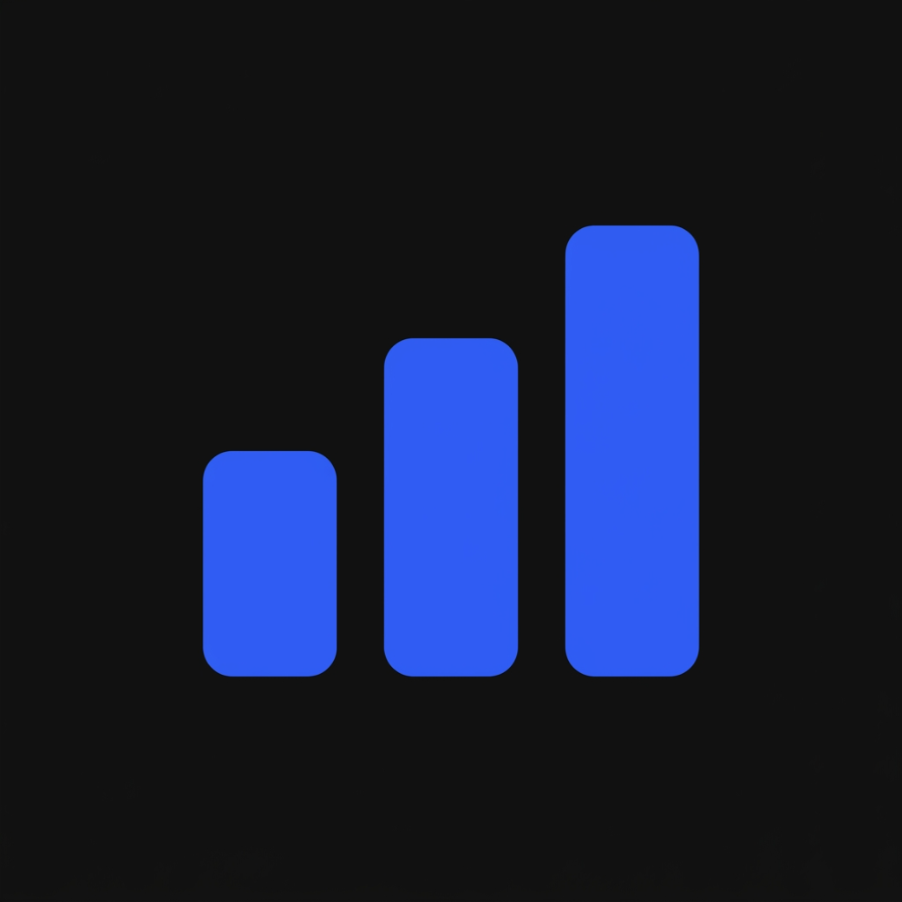
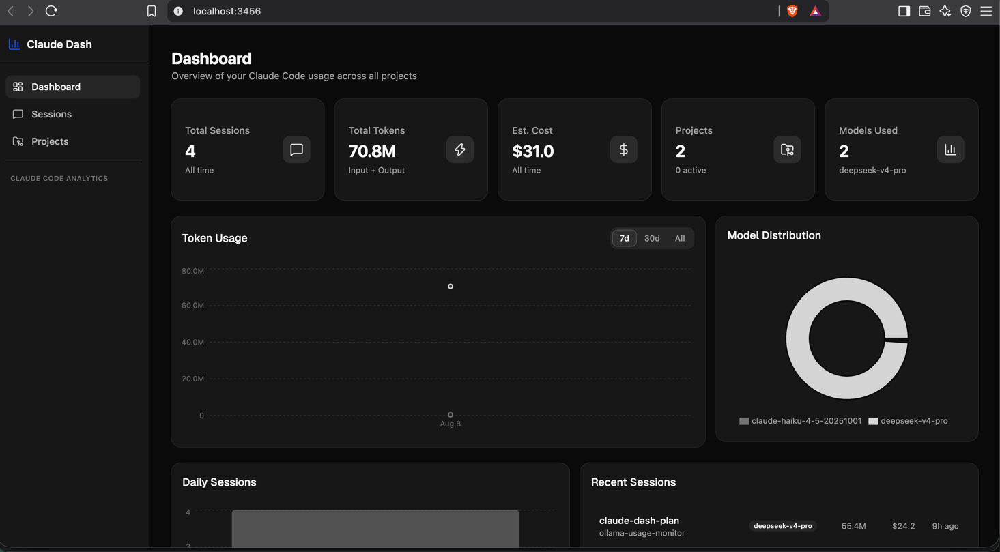

<p align="center">
  
</p>

# Claude Dash

A stunning dashboard for Claude Code session analytics and conversation browsing — token usage, cost tracking, model distribution, and session history, all in one local dashboard.



## Usage

Install globally, then run it anytime with a short command:

```bash
npm install --location=global @bhavy67/claude-dashboardboard
claude-dashboard
```

Or run it once without installing:

```bash
npx @bhavy67/claude-dashboardboard
```

Either way, this starts a local server and opens the dashboard in your browser automatically.

## Features

- **Dashboard overview** — total sessions, tokens, estimated cost, active projects, and models used at a glance
- **Token usage over time** — visualize input/output token consumption across 7 days, 30 days, or all time
- **Model distribution** — see which Claude models you're using and how often
- **Daily sessions** — track session activity day by day
- **Recent sessions** — quickly jump into recent conversations with per-session cost and token breakdowns
- **Project browsing** — explore usage broken down by project

## How it works

Claude Dash reads your local Claude Code session data and serves it through a lightweight local server — nothing leaves your machine.

## License

MIT © [Bhavy Ladani](mailto:bhavy.ladani6701@gmail.com)
